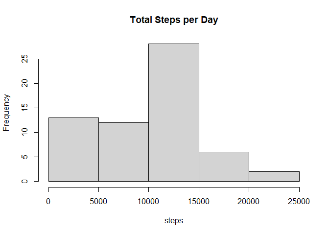
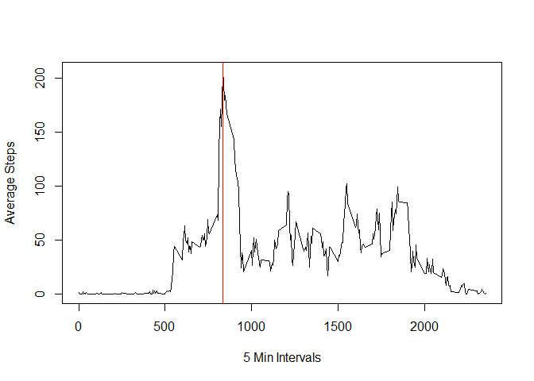
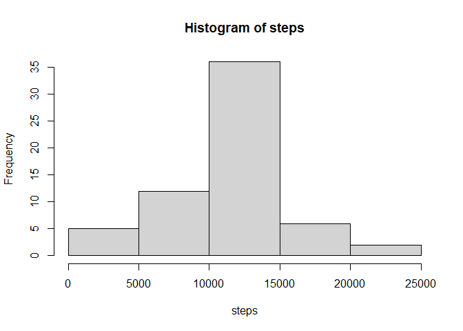
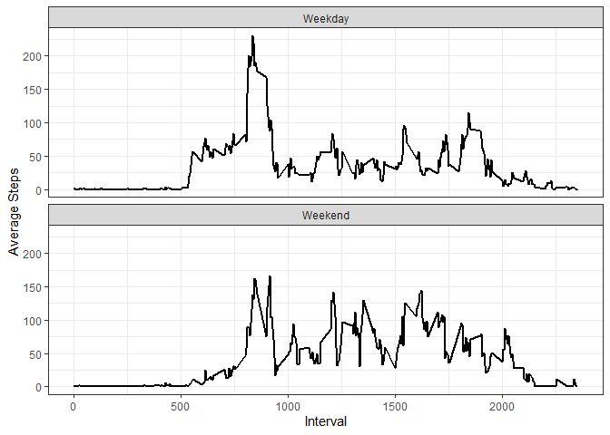

## Loading and preprocessing the data


First we will read in the data and change the date column to date objects.


``` r
df <- read.csv('./activity/activity.csv', header=TRUE)
df$date <- as.Date(as.character(df$date), "%Y-%m-%d")
```

## What is mean total number of steps taken per day?

**Question 1:** We calculate the total number of steps per day below, **ignoring NAs**.


``` r
steps <- tapply(df$steps, df$date, sum, na.rm=TRUE)
knitr::kable(steps, col.names = c("Date","Total Steps"))
```


|Date       | Total Steps|
|:----------|-----------:|
|2012-10-01 |           0|
|2012-10-02 |         126|
|2012-10-03 |       11352|
|2012-10-04 |       12116|
|2012-10-05 |       13294|
|2012-10-06 |       15420|
|2012-10-07 |       11015|
|2012-10-08 |           0|
|2012-10-09 |       12811|
|2012-10-10 |        9900|
|2012-10-11 |       10304|
|2012-10-12 |       17382|
|2012-10-13 |       12426|
|2012-10-14 |       15098|
|2012-10-15 |       10139|
|2012-10-16 |       15084|
|2012-10-17 |       13452|
|2012-10-18 |       10056|
|2012-10-19 |       11829|
|2012-10-20 |       10395|
|2012-10-21 |        8821|
|2012-10-22 |       13460|
|2012-10-23 |        8918|
|2012-10-24 |        8355|
|2012-10-25 |        2492|
|2012-10-26 |        6778|
|2012-10-27 |       10119|
|2012-10-28 |       11458|
|2012-10-29 |        5018|
|2012-10-30 |        9819|
|2012-10-31 |       15414|
|2012-11-01 |           0|
|2012-11-02 |       10600|
|2012-11-03 |       10571|
|2012-11-04 |           0|
|2012-11-05 |       10439|
|2012-11-06 |        8334|
|2012-11-07 |       12883|
|2012-11-08 |        3219|
|2012-11-09 |           0|
|2012-11-10 |           0|
|2012-11-11 |       12608|
|2012-11-12 |       10765|
|2012-11-13 |        7336|
|2012-11-14 |           0|
|2012-11-15 |          41|
|2012-11-16 |        5441|
|2012-11-17 |       14339|
|2012-11-18 |       15110|
|2012-11-19 |        8841|
|2012-11-20 |        4472|
|2012-11-21 |       12787|
|2012-11-22 |       20427|
|2012-11-23 |       21194|
|2012-11-24 |       14478|
|2012-11-25 |       11834|
|2012-11-26 |       11162|
|2012-11-27 |       13646|
|2012-11-28 |       10183|
|2012-11-29 |        7047|
|2012-11-30 |           0|

**Question 2:** Here is a histogram of the total steps per day.


``` r
hist(steps, main="Total Steps per Day")
```

<!-- -->

**Question 3:** The mean of total steps taken per day is,


``` r
mean(steps)
```

```
## [1] 9354.23
```

The median is, 


``` r
median(steps)
```

```
## [1] 10395
```

## What is the average daily activity pattern?

**Question 1:** Here is a time series plot of the 5-minute intervals (x-axis) and the average number of steps taken, averaged across all days (y-axis).
We ignored NAs to be able to compute the mean.


``` r
ts <- tapply(df$steps, df$interval, mean,na.rm=TRUE)
plot(as.numeric(names(ts)), ts, type="l", ylab="Average Steps", xlab="5 Min Intervals")
abline(v=835, col="red")
```

<!-- -->

**Question 2:** The 835th interval contains the maximum average number of steps occurs.

## Imputing missing values

**Question 1:** The total number of missing values is,


``` r
sum(is.na(df$steps))
```

```
## [1] 2304
```

**Question 2 & 3:** Our strategy will be to replace NAs with the mean number of steps for that interval across all days
(stored in ts variable from the last section).


``` r
for (i in seq_along(df$steps)) {
  if (is.na(df$steps[i])) {
    df$steps[i]<-as.numeric(ts[as.character(df$interval[i])])
  }
}
```

**Question 4:** Here is a histogram of the data with the imputed values,


``` r
steps <- tapply(df$steps, df$date, sum)
hist(steps)
```

<!-- -->

The updated mean of total steps taken per day is,


``` r
mean(steps)
```

```
## [1] 10766.19
```

The median is, 


``` r
median(steps)
```

```
## [1] 10766.19
```

The effect is that both values were boosted upwards, however, we notice that this method
made the mean and median identical, so is probably not a great imputation method to use and some
other rule should be used.

## Are there differences in activity patterns between weekdays and weekends?

**Question 1:** We create the factor variable as desired.

``` r
df <- mutate(df, wkday = weekdays(date) %in% c("Monday","Tuesday","Wednesday","Thursday","Friday"))
df$wkday <- factor(df$wkday,levels=c(TRUE,FALSE),labels=c("Weekday","Weekend"))
```

**Question 2:** The plots of the time series for the weekday and weekend are below.


``` r
ts <- tapply(df$steps, list(df$wkday,as.factor(df$interval)),mean)
df2 <- as.data.frame(as.table(ts))
df2[[1]] <- as.factor(df2[[1]])
df2[[2]] <- as.numeric(as.character(df2[[2]]))
names(df2) <- c("day","int","steps")
g <- ggplot(df2, aes(x=.data$int, y=.data$steps, group=.data$day))
g + geom_line(linewidth=1) + facet_wrap(~.data$day, nrow=2) + theme_bw() + labs(x="Interval",y="Average Steps")
```

<!-- -->
